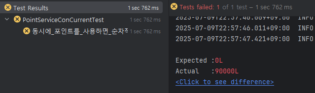

# TDD와 Application 레벨의 동시성 제어 Study
TDD 방법론을 적용하여 포인트를 충전/사용/조회하는 API를 작성하고 
Java 를 이용한 동시성 제어를 연습해보았다.

## 현재 문제점
예시 상황을 가정해보자.
- 유저가 10만원을 보유하고 있다.
- 짧은 시간 사이에 10,000원을 10번 사용한다.

```java
    @Test
    void 동시에_포인트를_사용하면_순차적으로_포인트가_차감된다() throws Exception {
        //given
        int threadCount = 10;
        ExecutorService executorService = Executors.newFixedThreadPool(threadCount);
        CountDownLatch countDownLatch = new CountDownLatch(threadCount);
    
        userPointTable.insertOrUpdate(2L, 100_000);
    
        //when
        for (int i = 0; i < threadCount; i++) {
            executorService.submit(() -> {
                try {
                    pointService.use(2L, 10_000L);
                } finally {
                    countDownLatch.countDown();
                }
            });
        }
    
        countDownLatch.await();
    
        //then
        Point point = pointService.findPoint(2L);
        assertThat(point.getAmount()).isEqualTo(0L);
    }
```
10,000원을 10번 썼으니 10만원을 사용하여 잔액은 0원이 될 것으로 예측할 수 있다.

하지만 실제 테스트 결과는 9000원이 나왔다.


이유는 이전 데이터 작업이 완료되지 않았는데 다음 요청이 데이터에 접근하여 작업을 시작하였기에 발생하였다.

이러한 현상을 레이스 컨디션(Race Condition) 이라고 한다.

| 포인트 잔액  | 요청 1                      | 요청 2       |
|---------|---------------------------|------------|
| 100,000 | 데이터 읽음 (100,000)          |            |
| 100,000    | 차감 작업 중(100,000 - 10,000) | 데이터 읽음 (100,000) |
| 90,000   | 데이터 업데이트(90,000)          | 차감 작업 중(100,000 - 10,000)   |
| 90,000   |                           | 데이터 업데이트(90,000)   |

레이스 컨디션이 발생하지 않도록 제어하는걸 **동시성 제어** 라고 하는데, 

Java Application 은 어떤 기능을 제공해주는지 알아보고자 한다.


----
## 1. synchronized
``synchronized`` 는 Java의 기본적인 동기화 수단으로,
**임계영역(critical section)** 을 설정해 다중 스레드 환경에서의 race condition 을 방지한다.

임계영역은 Lock을 가진 단 하나의 쓰레드가 출입할 수 있는 영역으로 클래스, 메서드, 메서드 내부 블록에 설정할 수 있다.
```java
    public synchronized Point use(Long id, Long amount) {
        // 임계영역
        Point point = pointRepository.findByUserId(id)
                .orElseThrow(() -> new CommonException(ErrorCode.NOT_FOUND_RESOURCE, "user"));
        usagePolicy.validate(amount, point.getAmount());
        Point usedPoint = point.use(amount);
        Point result = pointRepository.saveAndUpdate(usedPoint);

        pointRepository.writeLog(result, TransactionType.USE);
        return result;
    }
```
메서드에 ``synchronized``를 적용하니 테스트가 성공하였다.


간단하게 키워드 하나를 넣어 동시성을 제어할 수 있다는 점이 가장 큰 장점이지만

코드 블록 또는 메서드 전체에 락이 걸리기 때문에 세밀한 제어가 어렵고 

한 번 진입하면 락 해제 전까지는 강제적으로 블로킹되며, 타임아웃 설정, 조건 기반 락 제어 등이 불가능하기에 

아주 간단한 경우나, 프로토타입에서 사용하는 경우가 많다.

## 2. ReentrantLock
명시적인 Lock 객체 기반의 동기화 수단이다. ``synchronized``보다 더 많은 기능과 유연한 제어를 제공한다.

``tryLock()``을 지원하여 락을 기다리지 않고 즉시 시도하거나, 일정시간 동안 락을 기다리다 실패시 종료하도록 설정할 수 있어 
무한으로 대기하는 데드락이 발생하여도 대체 로직을 실행시킬 수 있도록 제어가 가능하다는 점이 가장 큰 차이라고 생각한다.

```java
    Lock lock = new ReentrantLock();

    public Point use(Long id, Long amount) {
        lock.lock();
        try {
            // 임계영역
            Point point = pointRepository.findByUserId(id)
                    .orElseThrow(() -> new CommonException(ErrorCode.NOT_FOUND_RESOURCE, "user"));
            usagePolicy.validate(amount, point.getAmount());
            Point usedPoint = point.use(amount);
            Point result = pointRepository.saveAndUpdate(usedPoint);

            pointRepository.writeLog(result, TransactionType.USE);
            return result;
        } finally {
            lock.unlock();
        }
    }
```
마찬가지로 테스트 통과하였다.


코드 상으로 보더라도 락의 획득과 해제를 명시적으로 처리해서 제어 흐름이 명확하단 점도
개발자 입장에서 코드를 놓치지 않고 파악할 수 있다는 점이 장점이다.

현 프로젝트에서는 사용할 일이 없지만 ``Condition``으로 락에 조건을 걸 수 있어 복잡한 시나리오에서 사용하기에 유리하다.

> 💡 **재진입이란?**
> 
> ``ReentrantLock``이 왜 Reentrant 일까 궁금하여 찾아보았다.
> 
> 재진입이란 **같은 스레드가 이미 획득한 락을 다시 획득할 수 있는 성질**을 말한다.
> 
> 즉, 락을 한 번 잡은 스레드가 자기 자신이 다시 같은 락을 요청해도 막히지 않고 정상적으로 실행 되는 성질이다.
> 
> 만약 재진입이 불가능하다면 락을 획득한 상태에서 또 락을 요청할 시 
> 자기 자신이 끝날 때까지 자기 자신이 기다리게 되어 데드락이 발생한다.
> 
> ``ReentrantLock`` 뿐만 아니라 ``synchronized``도 기본적으로 재진입이 가능하도록 설계되어있다.

## 3. Semaphore
지정된 허가 개수(permit) 만큼만 스레드가 공유 자원에 접근할 수 있도록 제한하는 클래스이다.
앞서 다른 제어들과 달리 **호출하는 쪽**에서 동시성을 제어한다.

따라서 테스트 코드를 수정해보았다.
```java
    @Test
    void 동시에_포인트를_사용하면_순차적으로_포인트가_차감된다() throws Exception {
        //given
        int threadCount = 10;
        ExecutorService executorService = Executors.newFixedThreadPool(threadCount);
        CountDownLatch countDownLatch = new CountDownLatch(threadCount);

        userPointTable.insertOrUpdate(2L, 100_000);

        Semaphore semaphore = new Semaphore(1); // 하나만 동시에 실행

        //when
        for (int i = 0; i < threadCount; i++) {
            executorService.submit(() -> {
                try {
                    semaphore.acquire();
                    try {
                        pointService.use(2L, 10_000L);
                    } finally {
                        semaphore.release();
                    }
                } catch (Exception e) {
                    e.printStackTrace(); // 실패 원인 확인
                } finally {
                    countDownLatch.countDown();
                }
            });
        }

        countDownLatch.await();

        //then
        Point point = pointService.findPoint(2L);
        assertThat(point.getAmount()).isEqualTo(0L);
    }
```
마찬가지로 테스트를 통과하였다.


동시 접근 Thread를 1로 고정하여 동시성을 제어하도록 쓸 수 있었지만, 

여러 쓰레드의 접근을 막는 기능을 제공해주기에 동시성 제어라기보단 **접근량 제어**에 사용하는 것이 맞다.

또한 포인트 사용은 어디서 사용되든 동시성이 제어되어야하는데 ``semaphore``은 호출하는 곳에서 제어를 해야하기 때문에

공부를 위해 적용해보긴 하였으나 현재 상황에서의 사용은 적절치 않은 것 같다.

## 실무에서 사용하지 않는 이유
동기화를 제어해야하는 상황이 존재함에도 내 경우 앞서 공부한 키워드들을 실무에서 사용하는 경우를 거의 못봤다.
그 이유에는 크게 두 가지가 있다.

1. 다중 서버 환경에서는 동시성 제어가 불가능하다.

    ``synchronized``나 ``ReentrantLock``은 JVM 내부 스레드 간 동기화만 제어할 수 있다. 
    하지만 실무에서는 WAS가 여러 대로 구성되어있고 요청이 각 서버로 분산되기에 한 서버에서 락을 걸어도 다른 서버에선 
    아무런제약 없이 요청이 처리되기에 동시성 제어가 실패하게 된다.
 
2. Spring에서의 ``@Transactional``과 함께 사용할 수 없다.

    해당 이유는 ``Transactionl``의 동작 방식 때문이다.
    ``@Transactionl``이 붙은 메서드는 프록시되고 프록시가 된 메서드가 끝나는 시점에 데이터베이스에 반영된다. 
    즉, Lock이 데이터베이스 반영 시점보다 빨리 풀리기 때문에 동시성 제어가 의미가 없게 되어 실패하게 된다. 

이런 이유로 실무에서는 DB 레벨의 동시성 제어와 Redis나 Kafka같은 도구를 이용하여 동시성 제어하는 경우가 더 많은 것으로 보인다.

## 정리
마지막으로 공부해본 세개의 동시성 제어 방법에 대해 정리하면 아래와 같이 해볼 수 있겠다.

| 항목                        | synchronized      | ReentrantLock                        | Semaphore                       |
| ------------------------- | ----------------- | ------------------------------------ | ------------------------------- |
| **주 목적**                  | 임계 영역 보호 (1명만 실행) | 임계 영역 보호 + 추가 제어 기능                  | **동시 접근 수 제한 (N명 허용)**          |
| **락 해제 방식**               | 자동 (블록/메서드 종료 시)  | 명시적 `unlock()` 필요                    | 명시적 `release()` 필요              |
| **tryLock 지원**            | 불가능               | 가능 (`tryLock()`, `tryLock(timeout)`) | 가능 (`tryAcquire()`)             |
| **타임아웃 제어**               | 불가능               | 가능                                   | 가능                              |
| **조건 변수 지원**              | `wait()/notify()` | `Condition.await()/signal()`         | 불가능 (조건 대기는 직접 구현해야 함)          |
| **중단 처리 (interruptible)** | 불가능               | 가능                                   | 가능                              |
| **재진입 가능**                | 가능                | 가능                                   | 불가능 (기본적으로 스레드별 소유 아님)          |
| **사용 장소**                 | 자원 내부             | 자원 내부                                | 자원 외부                           |
| **실행 제어 방식**              | 단일 스레드만 진입 가능     | 단일 스레드만 진입 가능                        | 복수 스레드 접근 허용 (갯수 제한)            |
| **추천 사용 상황**              | 간단한 임계영역, 빠른 구현   | 복잡한 락 조건, 타임아웃, 조건 분기                | 제한된 리소스 접근 (예: 동시 3명만 허용)       |

결과적으로 현재 단일 서버, DB연결 없는 프로젝트처럼 포인트 충전/사용에서 가장 적합한 동시성 제어는 ``ReentrantLock``이라고 결론지었다. 